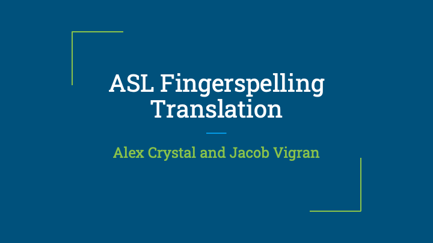
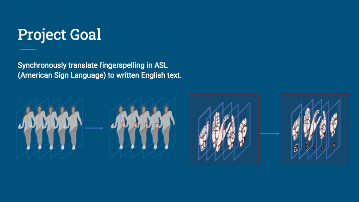
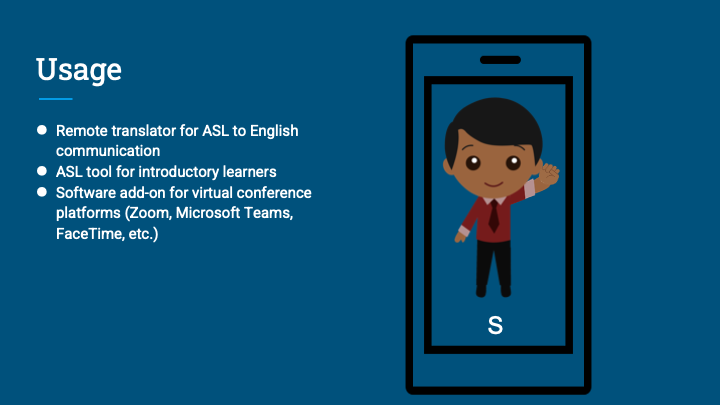
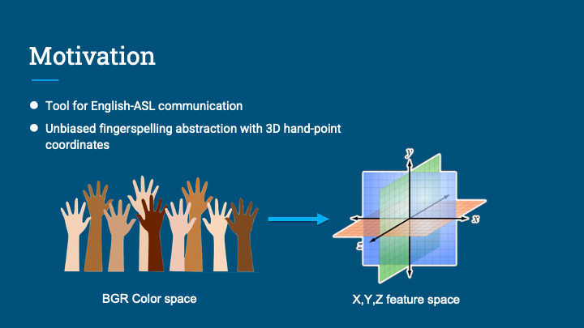
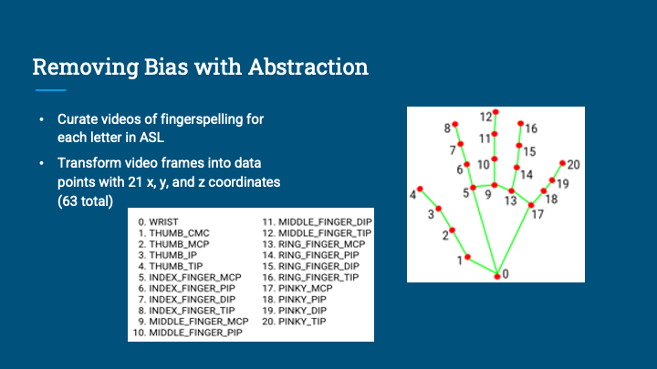
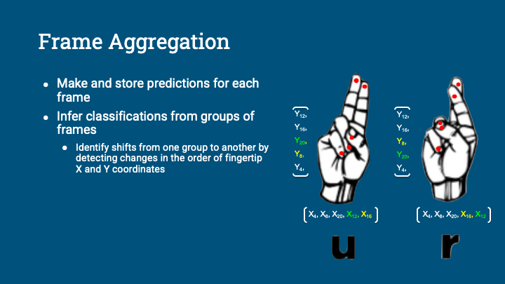

ASL Translating Application
===========================

What's Here
-----------

* README.md - this file
* requirements.txt - used to install dependencies
* src/ - source code for the Flask app
* src/models/ - translation model(s) for the Flask app
* src/templates/ - html templates for Flask app's front end
* src/static/ - static files used in the Flask app's front end

Getting Started
---------------

0. Navigate to project directory
	
	$ cd asl-fingerspelling-translator/

1. Create a Python virtual environment for the application

        $ python3 -m venv env_name

2. Activate the virtual environment:

        $ source env_name/bin/activate

3. Install Python dependencies for the Flask application:

        $ pip install -r requirements.txt

4. Start the Flask development server:

        $ flask run

5. Open http://127.0.0.1:5000/ in a web browser to view the output of your
   service.

6. Check out our analysis below!

